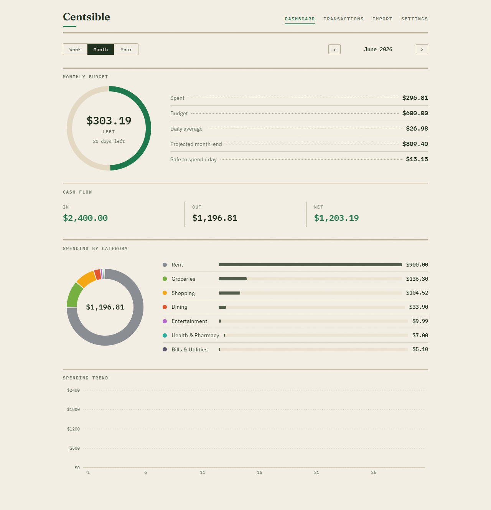

# Centsible

Local-first expense tracker. Your money data never leaves your device.

Centsible is a progressive web app for people who want to control monthly spending
without handing their financial history to a server. Everything is stored in your
browser's IndexedDB: there is no account, no sync service, no analytics, and no
network traffic carrying your data anywhere.



## Why another expense tracker

Most trackers fail on one of three points: they upload your data, they make entry
slow, or they bury the one number that matters. Centsible is built around a single
question - "am I on track this month?" - and a budget that excludes rent, so the
number you see is the number you control.

## Features

- **Monthly budget** with rent excluded by category flag: budget ring, daily
  average, month-end projection, and safe-to-spend-per-day.
- **Two-second entry**: type `coffee 6.5`, `lunch 12 yesterday`, or `tutoring +100`
  into the quick-entry box. Chinese works too (`午餐 17.38`). Voice input is
  available in browsers that support speech recognition.
- **Memo paste import**: if you have been logging spending in a notes app with lines
  like `6月16日：Target - 104.52`, paste the whole thing; Centsible parses it,
  cross-checks your own subtotal lines as a checksum, flags duplicates, and learns
  merchant-to-category mappings from your corrections.
- **Bank CSV import** (Chase format): card payments are skipped, returns become
  refunds, known categories map automatically, duplicates are detected.
- **Recurring transactions**: subscriptions post themselves when the app opens,
  catching up across missed months, with day-31 clamping for short months.
- **Income tracking** with the same categories, charts, and trends as expenses.
- **Visual dashboard**: budget ring, category donut with ranked bars, daily and
  monthly trend charts, cash flow strip, week/month/year switcher.
- **Backup and merge**: export everything as JSON; import merges by id so syncing
  phone data into a desktop is a two-step export/import with no duplicates.
- **Installable PWA**: works offline, installs to the home screen on Android and
  the desktop, and self-hosts its fonts so even font requests stay local.

## Quick entry cheatsheet

| Input                  | Result                                               |
| ---------------------- | ---------------------------------------------------- |
| `coffee 6.5`           | $6.50 expense today, category suggested from history |
| `lunch 12 yesterday`   | $12.00 expense dated yesterday                       |
| `groceries 80 6/3`     | $80.00 expense dated June 3                          |
| `tutoring +100`        | $100.00 income                                       |
| `coffee 6.5; lunch 12` | two transactions at once                             |

## Privacy model

- All data lives in IndexedDB in your browser profile.
- The app makes no network requests with your data; the only fetches are the app's
  own static files, which the service worker then caches for offline use.
- Backups are plain JSON files you create and store yourself.
- Clearing browser site data deletes everything; export a backup first.

## Development

```sh
npm install
npm run dev        # start the dev server
npm test           # vitest (jsdom + fake-indexeddb)
npm run lint       # eslint
npm run typecheck  # tsc
npm run build      # production build with service worker
npm run preview    # serve the production build
```

### Architecture

```
src/domain/    pure TypeScript business logic: money (integer cents), dates,
               budget math, recurring expansion, parsers (quick entry, memo,
               Chase csv), dedup, backup merge - no browser APIs, fully tested
src/db/        Dexie (IndexedDB) schema and repository; the only layer that
               touches storage
src/features/  React pages: dashboard, transactions, import, settings
src/i18n/      all user-facing strings (English today, swappable tomorrow)
```

Money is always integer cents parsed from strings - floating point never touches
an amount. Dates are ISO `yyyy-mm-dd` strings computed through UTC so timezones
cannot shift a calendar day.

### Verification scripts

```sh
node scripts/screenshot.mjs <url> <out.png> [width] [height] [seed]
node scripts/offline-check.mjs <url>
```

Both drive the locally installed Edge or Chrome through puppeteer-core: the first
captures screenshots (optionally seeding demo data), the second proves the service
worker serves the app with the network cut.

## License

MIT
